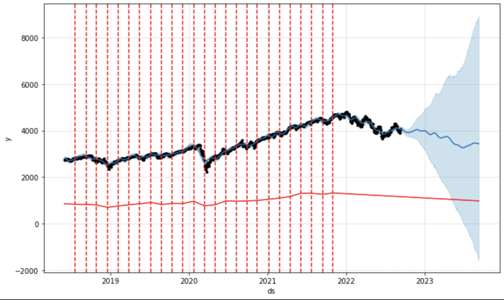

# Prophet ML Modeling vs. Monte-Carlo Simulation

Comparing traditional finance modeling methods (Monte Carlo via Euler Discretization) with more novel techniques — that being modeling via machine learning — to determine a more viable trading strategy for event contract trading on Kalshi. None of this is financial advice LOL.

## Getting Started

Nearly everything revolving around this project can be run in Jupyter Notebook, meaning that getting started simply involves installing Jupyter and then installing any missing packages that we will need using [pip](https://pip.pypa.io/en/stable/).

```
pip install (package)
```

## Motivation and Beginnings

[Kalshi](https://kalshi.com/) is the first ever CFTC-regulated exchange that allows investors to trade on event contracts, a class of assets that allows investors to invest and trade directly on the outcome of events. In their words, this system is the next evolution of regulated commodities, and expands the world of futures and markets, allowing people to trade on events they are fluent or interested in, without much of the traditional noise of investing.

As with any young market, the possibilities for arbitrage and alpha are endless, and Kalshi's markets, with such rapid turnover, especially within their daily and weekly markets, have the potential to allow for many strategies.

Now to the project itself; the key goal was to compare possible strategies for use on Kalshi's S&P 500 market and garner results about their effectiveness. One pick for this model comparison is Monte-Carlo Simulation, particularly via Euler Discretization, to predict stock pricing. The question became, was Monte-Carlo legitimately viable, or does it face severe pitfalls in accuracy. Next, pitting it against a novel method, machine learning, here with the Prophet API, with possible shortcomigns such as over/under fitting the data.

Initially, base models for the S&P 500 data were formed in `prophet_predictor.ipynb`. Further details and descriptions of very basic Prophet model creation, and also Euler Discretization, are in the file.

## Hyperparameter Tuning and Further Optimization

Obviously, using `m.fit(df)` is just not enough for a proper model, though we wish it was 😔. So, another notebook, `prophet_opt.ipynb` contains all of our optimization processes for the ML model. By the way, further documentation and info on Prophet can be found [here](https://peerj.com/preprints/3190/) for those interested.

Notable changes include, adding regressors, assessing changepoints created by the model, and, of course hyperparameter tuning of many variables; specific code and processes are in the file.

- Example of examining model changepoints 

## Final Models

With our optimization done, we can view our final models! They're found in the `final_models.ipynb` file. Note that these models simulate a years forecast, however we will only be looking at a few weeks into the future at most, and optimization was done with that in mind. Take a look at them below.

- Final Monte-Carlo Model (only 10 of many simulations) 
- Final Prophet Model 

## Kalshi Results

Finally, to Kalshi! 

- An example weekly S&P market on Kalshi 

Within this repo there is a basic client and tester for said client that allows users to gauge active markets, or any specific market, and implementation for submitting trades is rather simple. 

#### Overview of Results
- 2022 YTD as of early September, trading weekly, the Prophet Model correctly predicts the range of closing prices by upward of 75%.
- The Monte model garnered immense double-digit gains some weeks, but lost just as much, and more, other weeks. 
- Prophet model ended in profit.
- In the end, the Monte Model was pretty close to beaking even (+- 3%).

However, the Prophet model's true singaling function comes through a similar form to a different quantitative trading strategy: mean reversion. Applying the concepts of mean reversion to the forcasts by the Prophet model garners profit on 60% of weeks, and profit overall (This method also involves hedging).

At the end of the day, simply relying on the machine is likely not the best way to trade with the Prophet model; a trader's intuition can add much to this model, and a researcher's, well, research, can add just as much.

Future improvements to this project may include, a system that generates signals at key points that lead a trader to mean reversion trades, automatic trade execution via the Kalshi client provided, and, of course, improving model accuracy with more regressors, tuning, or perhaps turning to an entirely new platform for modeling.